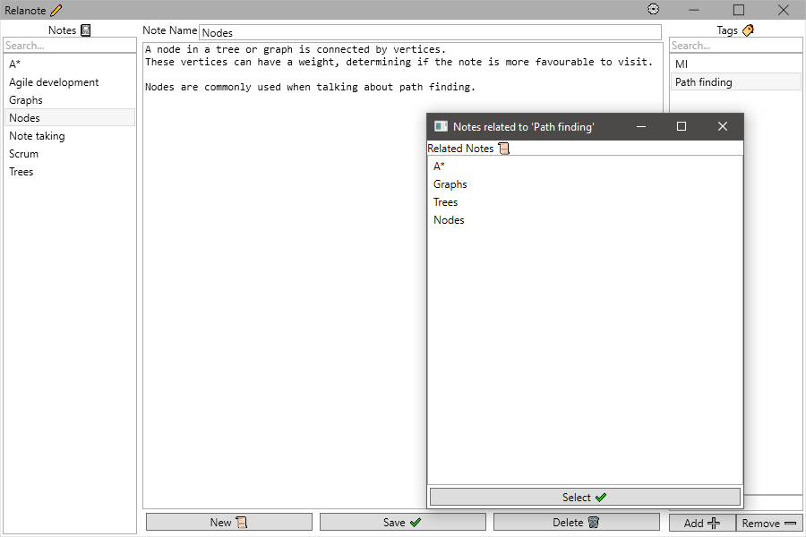

# Relanote :pencil2:

Relanote is a note taking app, with simplistic UI without distractions, so that you can take your best notes.

Want to contribute? See the [contribution guidelines](./contributing.md).

## Notes are related

Sometimes it can be hard to manage notes that are related to each other.
Luckily Relanote notes can be linked to each other, using relational tags. 
These tags are user defined, and will link all your notes together.
That way you can link all your notes about Corgis to Terriers :dog:

Notes related to the note you are currently viewing can be found, by double clicking a tag in the tag list.

## Offline and Portable

Relanote uses an SQLite database to store your notes.
This means the app can be used offline and is portable.
If you wish to store all your notes on a thumb drive, this is possible by simply storing the app on there.
